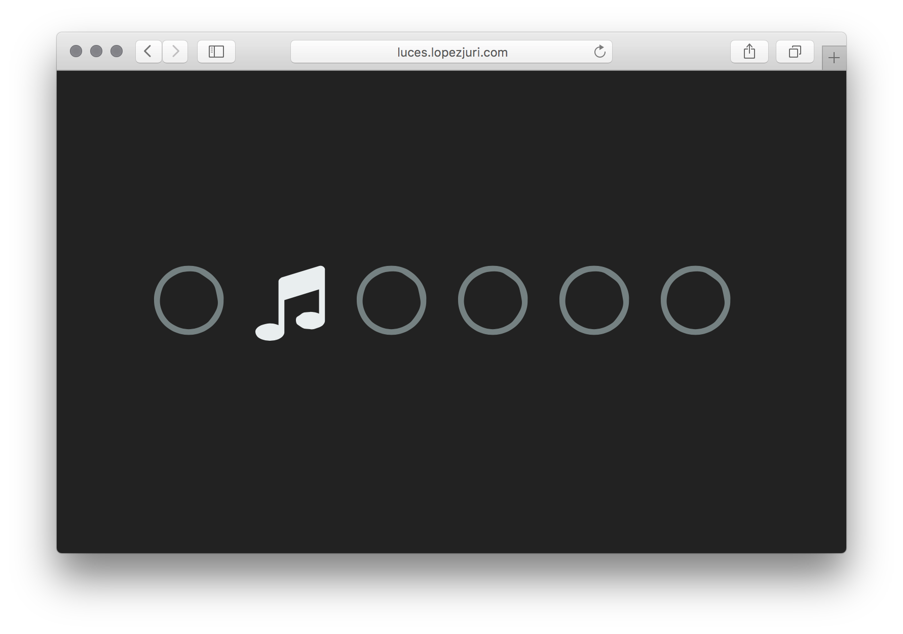

# Luces

Media lab project using Socket.io and React.js

See demo video at [`media/demo.mp4`](.media/demo.mp4)



## Components

Each component is in a separate repository:

* [mrpatiwi/luces-express](https://github.com/mrpatiwi/luces-express.git)
* [mrpatiwi/luces-react](https://github.com/mrpatiwi/luces-react.git)
* [mrpatiwi/luces-arduino](https://github.com/mrpatiwi/luces-arduino.git)

## Running

This project requires [Docker](https://www.docker.com/) and [Docker-compose](https://docs.docker.com/compose/)

```sh
git clone https://github.com/mrpatiwi/luces.git
cd luces

git clone https://github.com/mrpatiwi/luces-express.git
git clone https://github.com/mrpatiwi/luces-react.git
```

Start at port `http://localhost:3000`:

```sh
docker-compose up -d
```

## Running Arduino component

See [https://github.com/mrpatiwi/luces-arduino](https://github.com/mrpatiwi/luces-arduino)

Get the IP of the docker-machine instance:

```sh
# Change 'default' for your virtual machine name
docker-machine ip default
```

Set the host to the port `3000`. Take as example:

```js
const host = 'http://192.168.10.10:3000'
```

Then plug your Arduino, [setup the hardware](https://github.com/rwaldron/johnny-five/wiki/Getting-Started) and run it with:

```sh
npm start
```
